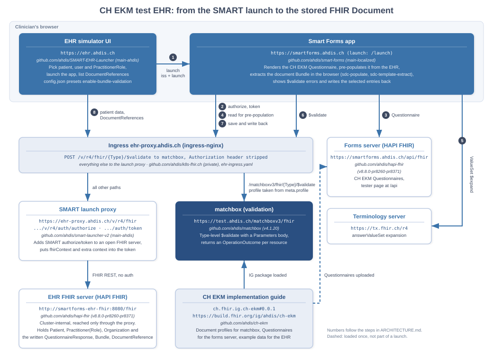

# CH EKM test EHR: architecture

This describes the test setup around https://ehr.ahdis.ch. It shows, from the EHR's side, how a CH EKM report is produced with a Questionnaire: the EHR launches the form, the form is pre-populated and completed, the FHIR Document is extracted, validated and written back to the EHR.

The CH EKM implementation guide describes the same process from the form's side, in four phases (launch context, pre-population, completion, extraction): [Path 2: Use the Questionnaire](https://build.fhir.org/ig/ahdis/ch-ekm/en/index.html#path-2-use-the-questionnaire). This page adds what an EHR has to provide around those phases, and which component does what in our setup.

Everything here is a test and demo environment. It holds fictional data only.

## Components

| Component | Endpoint | Source | Role |
|---|---|---|---|
| EHR simulator UI | https://ehr.ahdis.ch | [ahdis/SMART-EHR-Launcher](https://github.com/ahdis/SMART-EHR-Launcher), branch `main-ahdis` | Stands in for the EHR's user interface. The clinician picks the patient, the user and the PractitionerRole, launches Smart Forms, and later sees the stored DocumentReferences. |
| Smart Forms app | https://smartforms.ahdis.ch (launch URL `/launch`) | [ahdis/smart-forms](https://github.com/ahdis/smart-forms), branch `main-localized` | The SMART app. Renders the Questionnaire, pre-populates it, extracts the document, shows validation errors and writes back. All of this runs in the browser. |
| Ingress for the EHR base | https://ehr-proxy.ahdis.ch | [ahdis/k8s-fhir.ch](https://github.com/ahdis/k8s-fhir.ch) (private), `ahdis-infomaniak/smartforms-ahdis-ch/ehr-ingress.yaml` | Sends `POST /v/r4/fhir/{Type}/$validate` to matchbox and everything else to the launch proxy. |
| SMART launch proxy | https://ehr-proxy.ahdis.ch/v/r4/fhir, authorize and token under `/v/r4/auth/` | [ahdis/smart-launcher-v2](https://github.com/ahdis/smart-launcher-v2), branch `main-ahdis` | Adds SMART App Launch (authorize, token) on top of an open FHIR server and forwards FHIR requests to it. |
| EHR FHIR server | `http://smartforms-ehr-fhir:8080/fhir` (cluster-internal) | HAPI FHIR from [ahdis/hapi-fhir](https://github.com/ahdis/hapi-fhir), branch `v8.8.0-pr8260-pr8371` | The patient record: Patient, Practitioner, PractitionerRole, Organization, and what Smart Forms writes back. |
| matchbox | https://test.ahdis.ch/matchboxv3/fhir | [ahdis/matchbox](https://github.com/ahdis/matchbox), v4.1.20 | Validates resources against the CH EKM profiles. |
| CH EKM implementation guide | https://build.fhir.org/ig/ahdis/ch-ekm, package `ch.fhir.ig.ch-ekm#0.0.1` | [ahdis/ch-ekm](https://github.com/ahdis/ch-ekm) | Source of the document profiles (loaded into matchbox), the Questionnaires (uploaded to the forms server) and the example data (loaded into the EHR FHIR server). |
| Forms server | https://smartforms.ahdis.ch/api/fhir, tester page at https://smartforms.ahdis.ch/api | HAPI FHIR, same image as the EHR FHIR server | Holds the CH EKM Questionnaires. |
| Terminology server | https://tx.fhir.ch/r4 | | Expands the value sets behind coded answers. |

The deployment manifests for all of these are in `k8s-fhir.ch`, under `ahdis-infomaniak/smartforms-ahdis-ch` (matchbox: `ahdis-infomaniak/ahdis-test-ch/matchboxv3`). Its readme covers images, configuration and data loading.

## What happens during a launch

The numbers match the diagram.

1. **Launch.** In the EHR UI the clinician selects a Patient, a user (Practitioner) and that user's PractitionerRole, optionally a Questionnaire, and launches Smart Forms. The browser opens `https://smartforms.ahdis.ch/launch` with `iss` (the proxy's FHIR base) and an opaque `launch` value that carries the selection.
2. **Authorize and token.** Smart Forms runs the SMART App Launch flow against the proxy. The token response contains `patient`, the `fhirUser`, a `fhirContext` with the PractitionerRole (and the Questionnaire, if one was picked), and the extra context `https://smartforms.csiro.au/smart-app-launch/extra-context/enable-bundle-validation` = `true`. The EHR UI's `config.json` presets that last value for every app.
3. **Questionnaire.** Smart Forms loads the CH EKM Questionnaire from the forms server.
4. **Pre-population.** Smart Forms reads the launch context resources through the proxy and evaluates the Questionnaire's `initialExpression`s. `%patient` is the Patient and `%user` is the PractitionerRole. `%user.practitioner.resolve()` and `%user.organization.resolve()` fetch the Practitioner and the Organization from the EHR FHIR server.
5. **Completion.** The clinician answers the remaining questions. Coded answers come from value sets that Smart Forms expands on the terminology server.
6. **Extraction and validation.** On Save as Final, Smart Forms extracts in the browser, using the Bundle template contained in the Questionnaire. The result is a transaction Bundle with the `document` Bundle and a DocumentReference pointing to it. Each entry is sent to `POST <EHR base>/{Type}/$validate`. The ingress routes these calls to matchbox, which validates against the profile named in the resource's `meta.profile` and returns an OperationOutcome.
7. **Write-back.** A dialog lists the entries. An entry with validation errors is shown with its error messages and cannot be selected; a "Copy JSON" button copies the resource for a closer look. On confirmation Smart Forms saves the QuestionnaireResponse and posts the selected entries as a transaction to the EHR base, which the proxy forwards to the EHR FHIR server.
8. **Back in the EHR.** The patient's Document References tab lists the new DocumentReference with a link to the document Bundle. A delete button removes a DocumentReference together with the Bundle it points to.

## Behaviour worth knowing

- **Validation goes to the EHR's own base URL.** Smart Forms has no validator setting. It calls `$validate` on the server it writes to, so an EHR that wants CH EKM validation has to answer that operation with the CH EKM profiles loaded. Here the ingress does this by handing those calls to matchbox. The SMART access token is not forwarded to matchbox.
- **Validation is opt-in.** Without the `enable-bundle-validation` field in the token response, Smart Forms skips step 6's `$validate` calls and offers every entry for write-back.
- **`meta.profile` decides what is checked.** Smart Forms sends no `profile` parameter. A resource without `meta.profile` is validated against the core FHIR profile only. The CH EKM document templates set it.
- **Only errors block.** Entries with `error` or `fatal` issues are excluded. Warnings and information issues are ignored. If the `$validate` call itself fails, the entry counts as valid.
- **Entries are judged one by one.** If the document Bundle fails and the DocumentReference passes, the dialog still offers the DocumentReference on its own.
- **The PractitionerRole must be in the launch.** Without it `%user` is unbound and the physician and organisation fields stay empty. The proxy only passes it on when the app requests the plain `launch` scope.
- **The EHR is open.** The proxy checks a token only when one is sent, so anyone can read and write the EHR FHIR server through `ehr-proxy.ahdis.ch`. This is the same as launch.smarthealthit.org and is why only fictional data belongs there.
- **Extraction is "modified only".** Smart Forms pre-populates the form a second time and extracts only what differs from that baseline.
